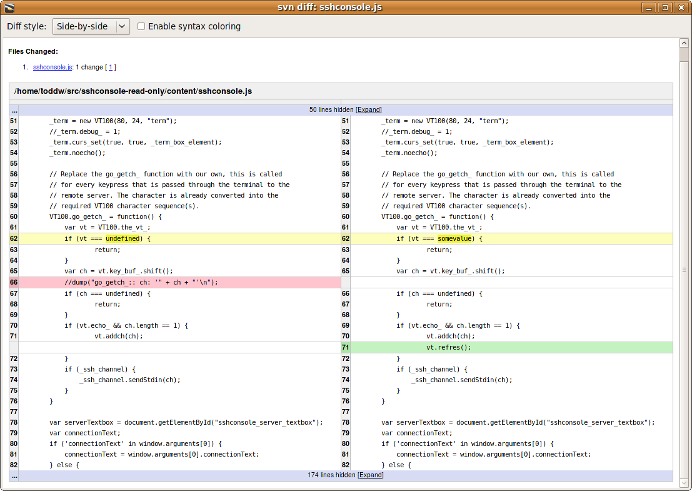

# Komodo Side-By-Side Diffs

Provides the ability to use side-by-side diffs inside of Komodo. You get to
choose which diff style you want on demand (contextual or side by side), simply
choose the style you want inside of the Komodo diff dialog.

## Screenshot

## Download

You can use Komodo's "Tools > Add-ons" dialog to install the add-on, since the
add-on is published on the Komodo community extension list:
http://community.activestate.com/xpi/side-side-diff

## Building from source

  koext build --unjarred

